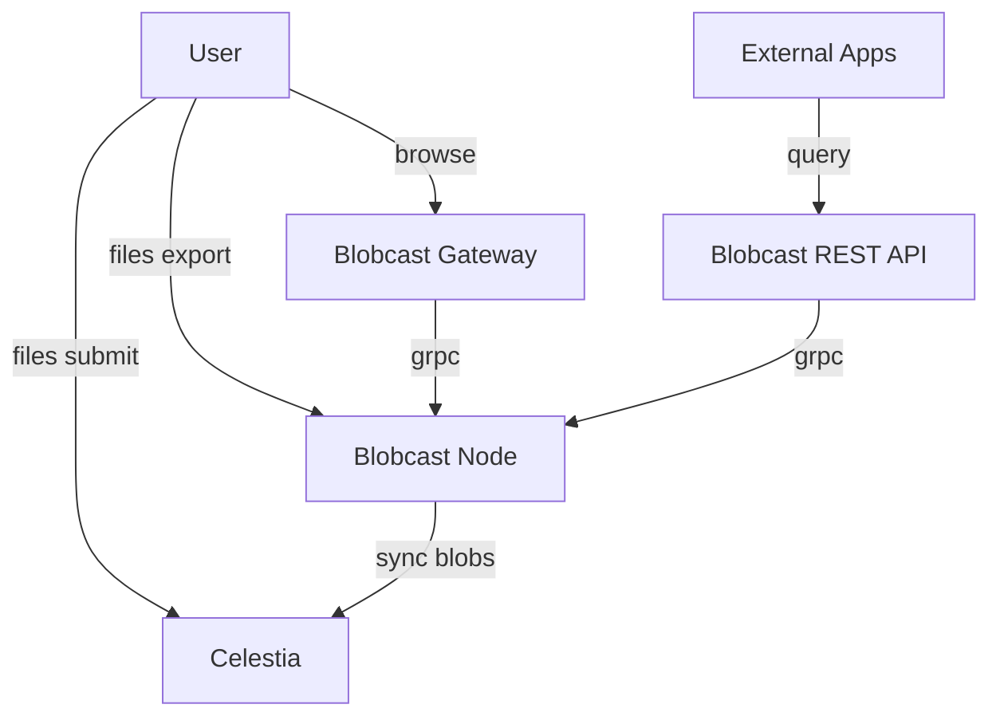

# Architecture

Blobcast is intentionally minimal. All chain state is derived from just two sources:

1. **Celestia Headers** – provide ordering, data-availability proofs and finality.
2. **Deterministic State Machine Code** – immutable, append-only state transitions _found mostly in [`pkg/sync/chain.go`](../pkg/sync/chain.go)._

Because there is **no virtual-machine**, any honest node will derive the same chain state when given the same Celestia header stream.



## Transactions

Every message submitted to Celestia by Blobcast is a single **BlobcastEnvelope**.  The envelope contains a `payload` that can be exactly **one** of the following:

* `ChunkData` – raw byte slice of a file chunk.
* `FileManifest` – metadata describing a complete file and the ordered list of chunks that re-assemble it.
* `DirectoryManifest` – metadata describing a directory tree and the list of files that belong to it.

This is the **only** transaction type understood by the Blobcast state machine.

### BlobIdentifier

Every payload listed inside a block is referenced by a **BlobIdentifier**.  It is a compact, self-describing pointer consisting of:

* `Height` – the Celestia height at which the blob was included.
* `Commitment` – the share commitment returned by Celestia for that blob.

The pair is serialized and then base-36 encoded **with the prefix `bc`**.  This encoded string is what appears in Blobcast URLs:

```
blobcast://bc48ktvz8ajakmwu2o6vkdhg4b5j1c3nveq11f0y29xkqe7hzdjmvsxdfdnco4
```

### ChunkData

The smallest unit is a *chunk* – an arbitrary byte slice. A chunk is wrapped in a `ChunkData` protobuf message and then in a `BlobcastEnvelope` before submission.

```
BlobcastEnvelope {
  ChunkData {
    string version
    bytes chunk_data
  }
}
```

### FileManifest

A *file manifest* describes a complete file by listing the ordered chunks, its total size, mime-type, compression algorithm, and a SHA-256 hash of the reconstructed file.

```
BlobcastEnvelope {
  FileManifest {
      repeated ChunkReference chunks  // order matters
      string  file_name
      uint64  file_size
      bytes   file_hash
      string  mime_type
  }
}
```

### 3. DirectoryManifest
A *directory manifest* is a flat list of files (relative path + id).  It allows reconstructing arbitrarily deep directory trees.

```
BlobcastEnvelope {
  DirectoryManifest {
      string directory_name
      repeated FileReference files
      bytes directory_hash
  }
}
```

## Blocks & State machine

For every Celestia height **H** inside the selected namespace, greater than or equal to height offset **O**, the node runs:

1. Fetch all blobs `B(H)`.
2. Validate each `BlobcastEnvelope`.
3. Record *only* those whose dependencies are already satisfied:
   * all `ChunkData` are accepted
   * a `FileManifest` is accepted only if **all** its chunks were seen.
   * a `DirectoryManifest` is accepted only if **all** its files were seen.
4. Build a `Block` with:
   * a height of `H - O`
   * the parent block hash
   * `Body.Chunks`, `Body.Files`, `Body.Dirs` – the identifiers accepted in step 3.
   * a merkle root for each of `Body.Chunks`, `Body.Files`, `Body.Dirs`
   * an updated Merkle-Mountain-Range (MMR) root obtained by appending the non-zero Merkle roots of `Body.Chunks`, `Body.Files`, and `Body.Dirs` as new leaves
5. Persist the block and mark the height as finalised.

The resulting chain is append-only and immutable; every node derives the same state deterministically from the blobs published in the selected Celestia namespace.

## Inclusion proofs

Each block header contains four cryptographic commitments that make data verifiable without needing the full history:

1. **ChunksRoot** – Merkle root over all `ChunkData` identifiers in the block.
2. **FilesRoot**  – Merkle root over all `FileManifest` identifiers.
3. **DirsRoot**   – Merkle root over all `DirectoryManifest` identifiers.
4. **StateRoot**  – Merkle-Mountain-Range (MMR) root that incrementally commits to *every* previous block's `DirsRoot`, `FilesRoot`, and `ChunksRoot`.

Given these roots a light-client can prove that a particular chunk, file or directory was accepted by the rollup:

* **Intra-block proof** – a conventional Merkle inclusion proof that links a payload identifier to its block-level root (`ChunksRoot`, `FilesRoot`, or `DirsRoot`).
* **MMR extension** – combine an intra-block proof with an MMR proof that links a block-level root to the latest `StateRoot`, so it can be verified using only the most recent header.

Together these proofs are logarithmic in size and can be verified against just the most recent block header, enabling efficient light-client verification.

## Local state

All durable state is kept under `~/.blobcast/{network}/` using [Pebble](https://github.com/cockroachdb/pebble):

* **Chain store** – canonical blocks, finalised height, MMR snapshots.
* **Chunk store** – raw chunk bytes keyed by share commitment.
* **Manifest store** – file & directory manifests keyed by identifier.
* **Upload state** – resumable uploads per local machine.

## Networking surfaces

1. **gRPC API** – machine-readable interface for querying manifests, files, and blockchain state.
2. **Web Gateway** – lightweight web UI for browsing directories and downloading files using BlobIdentifiers.
3. **REST API** – HTTP/JSON API for integration with external systems and applications.

## CLI interface

Blobcast ships with a single executable `blobcast` that groups several sub-commands. For full flag details see `docs/cli.md`; below is a quick overview:

| Command | Purpose |
|---------|---------|
| `node start`    | Runs a full node: synchronizes the chain and exposes the gRPC APIs. |
| `gateway start` | Starts the web gateway for browsing directories and files. |
| `api start`     | Starts the REST API server for HTTP/JSON integration. |
| `files submit`  | Publishes a file or directory: splits, (optionally) encrypts, submits chunks and manifests. |

## Security properties

* **Data availability**: guaranteed by Celestia once the blob is included.
* **Integrity**: SHA-256 hashes checked at every layer (chunk, file, directory, block).
* **Privacy**: optional AES-256 encryption per file before chunking.

## Future work

* Light-client proofs
